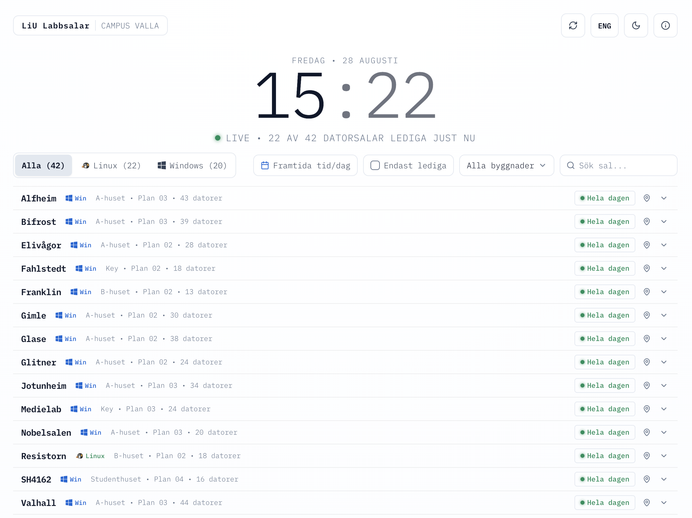
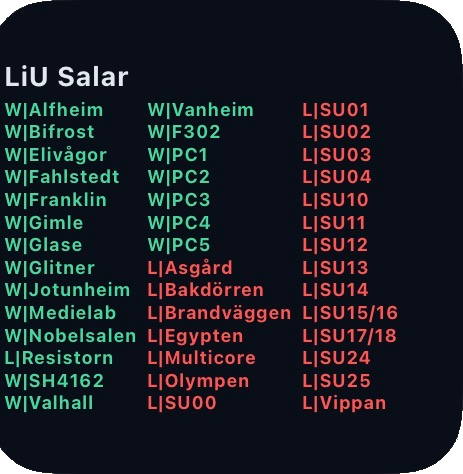

# LiU Lab Rooms (Campus Valla)

A fast, mobile-friendly web app showing real-time computer lab availability at Linköping University Campus Valla.

<p align="center">
  
</p>

## Features

- **Live Availability**: See if the 42 computer labs on Campus Valla is free, ending soon, or occupied.
- **Future Schedules**: Pick any day and time over the next 14 days to see upcoming room schedules.
- **Campus Navigation**: Direct links to Mazemap indoor navigation for every lab.
- **Filters & Search**: Filter by OS (Linux/Windows), building (B-huset, A-huset...), or free-only.
- **Zero Maintenance**: Queries TimeEdit's persistent JSON endpoint directly with edge caching.
- **Persistent Settings**: User preferences persist across browser sessions.
- **iOS Widget**: Scriptable widget displaying live color-coded room status.

## Architecture

```text
┌────────────────┐      ┌───────────────────┐      ┌──────────┐      ┌──────────┐
│  TimeEdit API  │ ───> │ /api/rooms (Edge) │ ───> │  Engine  │ ───> │ React UI │
└────────────────┘      └───────────────────┘      └──────────┘      └──────────┘
```

## Project Structure

```text
src/
├── app/api/rooms/route.ts   # Edge route querying TimeEdit JSON API
├── app/layout.tsx           # Layout, analytics & anti-FOUC theme script
├── app/page.tsx             # Main application page & state orchestration
├── components/              # UI components (FilterBar, HeroClock, RoomCard, Modals)
├── data/rooms.ts            # Catalog of 42 computer labs, IDs & Mazemap URLs
├── lib/availability.ts      # Availability engine & Gantt timeline calculations
├── lib/timeedit.ts          # TimeEdit JSON parser & timeout handling
├── lib/usePreferences.ts    # localStorage user preferences (theme, lang, filters)
├── lib/i18n.ts              # Swedish & English translation dictionaries
└── tests/                   # Test suite for availability engine, catalog & preferences
```

## Lab Rooms Included (42 Total)

- **22 Linux Lab Rooms** (B-huset): Asgård, Bakdörren, Brandväggen, Egypten, Multicore, Olympen, Resistorn, SU00–SU04, SU10–SU14, SU15/16, SU17/18, SU24, SU25, Vippan.
- **20 Windows Lab Rooms**: Alfheim, Bifrost, Elivågor, F302 (Fysikhuset), Fahlstedt (Key), Franklin (B-huset), Gimle, Glase, Glitner, Jotunheim, Medielab (Key), Nobelsalen, PC1–PC5 (E-huset), SH4162 (Studenthuset), Valhall, Vanheim.

## Development

```bash
# Install dependencies
npm install

# Run development server
npm run dev

# Run test suite
npm test

# Build for production
npm run build
```

## iOS Widget (Scriptable)

<p align="center">
  
</p>

1. Install [Scriptable](https://scriptable.app) on iOS.
2. Copy [`scripts/liu-lab-widget.js`](scripts/liu-lab-widget.js) into a new script in Scriptable.
3. Add a Scriptable widget to your Home Screen and select the script.

Symbols and colors:
- W = Windows Lab room, L = Linux Lab room
- Green = Free (for > 3 hours)
- Yellow = Free for x min (for < 3 hours)
- Red = Booked

## License

GNU General Public License v3.0 — see [LICENSE](LICENSE).
